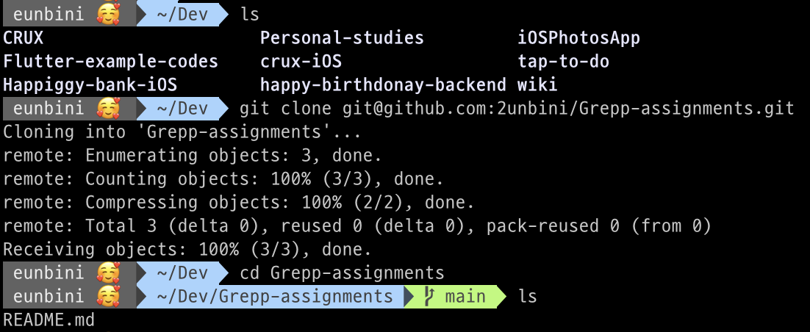
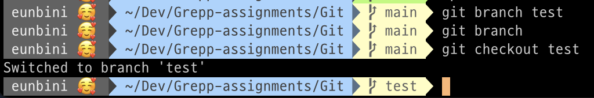
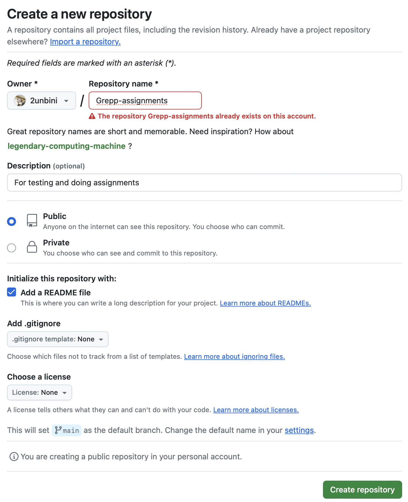

# Git Branch

코드의 분산 작업, 버전 관리를 할 때 브랜치가 유용하다.

기본으로 생성되는 master(main) 브랜치에 해당 레포지토리를 공유하고 있는 모든 개발자들이 코드를 수정하고 수정된 내용을 적용하면 각자의 수정 내용이 보장되지 않는다.

동시 수정에 대한 처리 뿐만 아니라, 어디까지가 어떤 버전인지 구분하는데에 브랜치는 큰 역할을 한다.

