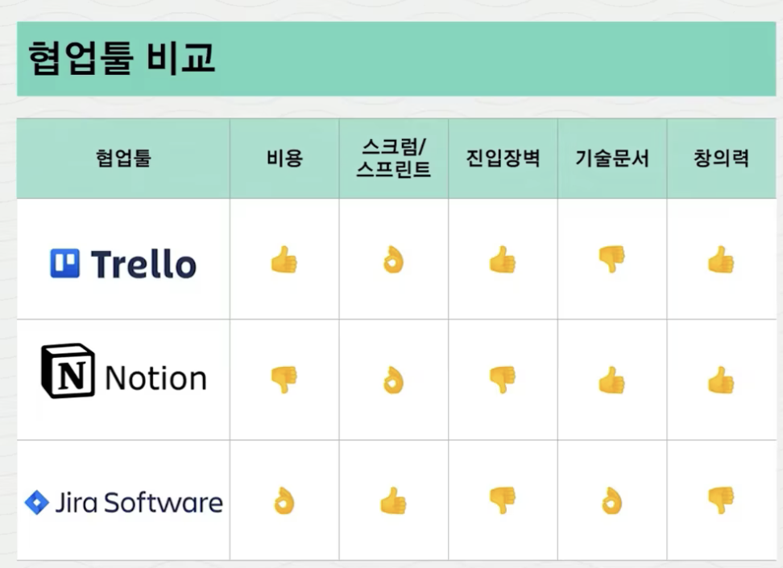

Trello는 사용해보지 않아서 모르겠지만, Jira와 Notion은 잘 쓰면 좋은 협업툴이라고 생각한다.

특히, 버전관리를 위한 Git과 연결해서 쓰면 Jira의 이슈 티켓이 자동으로 상태가 변경되어 관리가 용이하다. Notion 또한 기획자, 디자이너 등과 함께 사용하거나 Wiki 문서를 만들 때 좋은 툴이라고 느낀다.

다만, 강의에서 이야기한것처럼 무료 버전으로 접근할 수 있는 기능이나 인원이 한정돼있는 부분이나 각 프로그램의 특성에 따라 개발에 특화된, 문서화에 특화된 특징이 있어 무작정 '남들 다 쓰니까' 쓰는 것은 지양해야겠다.

회사를 다닐 때 가장 좋았던 것은 스크럼과 회고였는데, 업무 시작과 후에 짧게 오늘 해야 할 일, 팀 스케줄 정리 등을 스크럼으로 정리할 수 있었고, 오늘 어떤 일을 했고 어떤 점이 부족했는지 개인적으로 회고하는 것과 스프린트 전체의 회고를 통해 다음 협업에서 발전할 수 있는 가능성을 많이 열어둘 수 있다는 점에서 좋았다.
