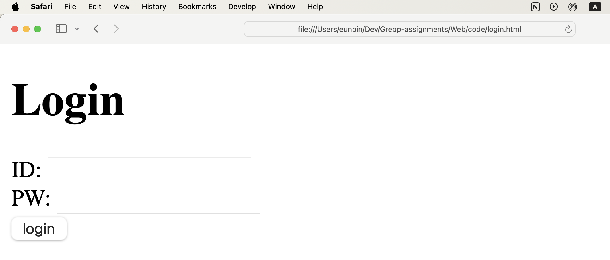

# Web

### Web Browser
- 웹 브라우징, 웹 서핑 등 웹 페이지/사이트 상에 방문해 어떠한 정보를 찾을 수 있게 하는 것.
- Safari, Chrome 등

### 웹의 구조
Client <-> Server

### HTML/CSS/JS
구조: HTML
디자인: CSS
유저 액션 등 event handling: Javascript

### 로그인 화면
```html
<!DOCTYPE html>
<html lang="en">
<head>
	<meta charset="UTF-8">
	<title>Login</title>
</head>
<body>
	<h1>Login</h1>
	<form action="">
		ID: <input type="text">
		<br>
		PW: <input type="password">
		<br>
		<input type="button" value="login">
	</form>
	
</body>
</html>
```

위 코드 실행시 다음과 같은 웹 페이지 생성



## HTML

```html
<html lang="en"> <!-- html 문서 정의부 -->
<head> <!-- html 문서 정보부 -->
	<meta charset="UTF-8">
	<meta name="viewport" content="width=device-width, initial-scale=1.0">
	<title>Document</title>
</head>
<body> <!-- html 문서의 내용부, 구조를 담는 부분 -->
	<h1> Title </h1>
	<div></div>
	<a href="link_reference"></a>
	<input>
</body>
</html>
```

- <>로 이루어져있는 키워드는 HTML Element(Tag)
- DOM(Document Object Model)으로 파싱되는 단위

## CSS
```css

/* 특정 요소 선택 */
h1, div {
	color: yellow;
	font-size: 30px;
}

/* id를 가지는 요소 선택 */
#id_name {
	...
}

/* class 요소 선택 */
.class_name {
	...
}

/* 전체 요소 선택 */
* {
	...
}

```

- HTML에 스타일 요소를 정의하는 서식 문서.
