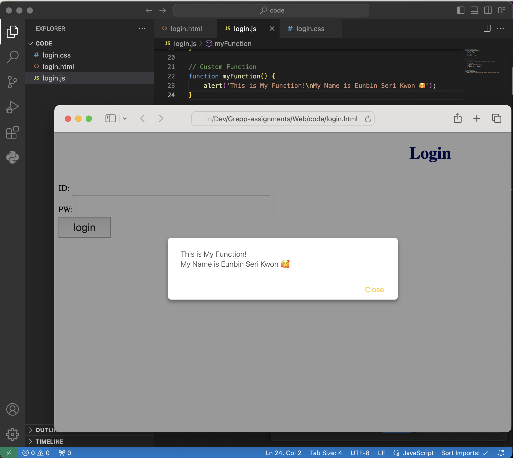

# CSS
- 인라인: HTML 태그 안에 함께 작성
- 내부 스타일 시트: HTML 문서 안에 작성
- 외부 스타일 시트: HTML 문서 밖에 작성, 그 후 연결

### 외부 스타일 시트 연결하려면?
```html
<!DOCTYPE html>
<html lang="en">
<head>
	<meta charset="UTF-8">
	<title>Login</title>
	<link rel="stylesheet" href="login.css">
</head>
...
```
<link> 태그에 rel="stylesheet"로, href는 외부에 정의된 css 파일 이름으로 만들어주면 된다.

# JS

CSS와 동일하게 인라인, 내부/외부 스크립트로 나누어져 있다.

### 스크립트 언어
프로그램을 제어하는 **스크립트 역할**을 하는 언어.

### 외부 스크립트 연결하려면?
CSS와 비슷하다. 헤드 태크 안에 다음과 같은 코드를 추가한다.

```html
	<script type="text/javascript" src="login.js"></script>
```

내부 스크립트에서는 <script></script> 태그 안에 해당 동작을 하는 함수나 코드가 들어가는데, 이를 별도의 자바스크립트 파일로 분리해 연결해주면 외부 스크립트로 불러와 사용할 수 있다.

# Screenshots


