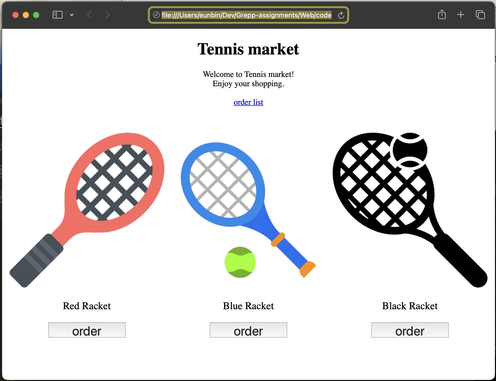
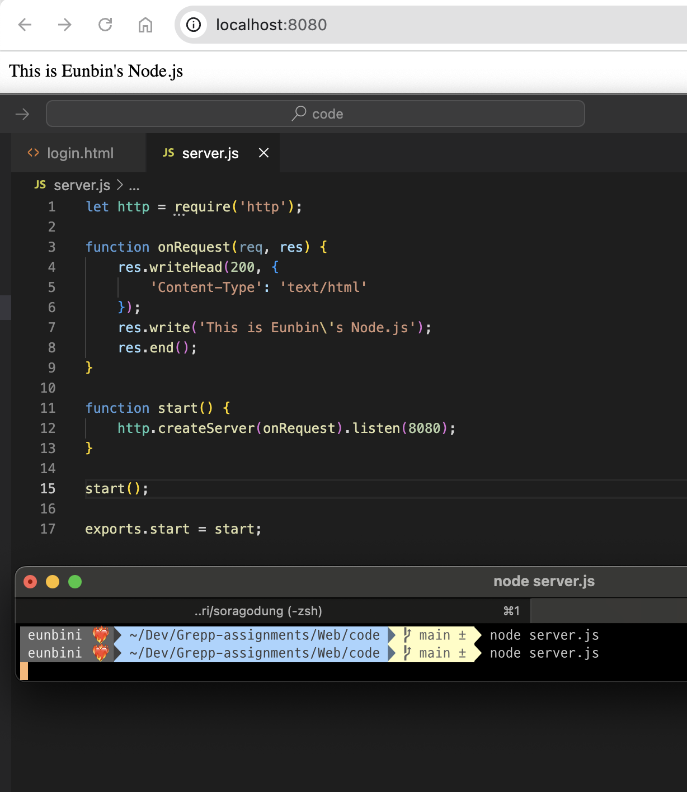

# 웹페이지 클라이언트 사이드, 서버사이드 만들기

## 클라이언트 사이드

## 서버 사이드

### 모듈화

Node 진영에서 모듈화를 할 때 필요한 것은 `export`와 `require`다.

모듈화를 위해 열심히 파일 쪼개기를 했는데 실상 가져다 쓰는 게 안된다면, export를 했는지 확인해보자.

### HTTP Request/Response

클라이언트 사이드와 서버 사이드가 통신을 위해 만들어놓은 규약.

주요한 Status code들을 잘 활용하면 코드만으로도 소통하기 좋을 거라 생각한다.

그런데, 간혹 400대, 500대 에러가 발생하는 경우에도 `200`을 떨어뜨리는 경우가 있다.

이는 400, 500 에러때문에 클라이언트 사이드가 먹통이 되는 것을 방지하고, 응답 바디에 문제 상황을 같이 기술하여 클라이언트 사이드에서 적절한 조치를 취할 수 있도록 하는 것이다.