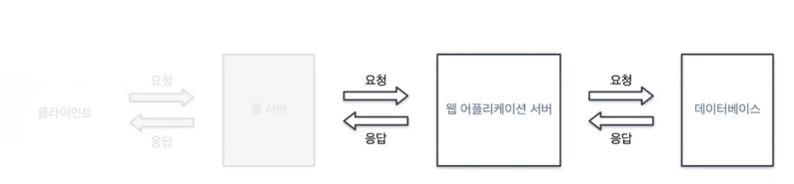

# 백엔드



웹 개발에서 클라이언트 사이드와 서버 사이드의 차이는 위 그림에서 볼 수 있다.

사용자 액션, 데이터 변경에 따라 실시간으로 바뀌는 `동적페이지`를 담당하는 것이 서버 단의 역할이다.

반대로 동일한 상태를 유지하는 `정적페이지`는 클라이언트 사이드 및 웹 서버에서 담당한다.

## WS(Web Server) vs WAS(Web Application Server)

AWS에 웹 서버와 어플리케이션 서버의 차이점을 다룬 글이 있다. 여기서 각 서버의 작동 방식을 보면 그 차이점을 명확히 알 수 있다.

### 웹 서버 작동 방식
웹 서버는 **웹 사이트의 코드와 데이터를 호스팅**하는 기술입니다. 브라우저에 URL을 입력할 때 이 URL은 실제로 웹 서버의 주소 식별자입니다.

브라우저와 웹 서버는 다음과 같이 통신합니다.

1. 브라우저는 URL을 사용하여 서버의 IP 주소를 찾습니다.
2. 브라우저는 정보에 대한 HTTP 요청을 보냅니다.
3. 웹 서버는 데이터베이스 서버와 통신하여 관련 데이터를 찾습니다.
4. 웹 서버는 HTTP 응답으로 HTML 페이지, 이미지, 비디오 또는 파일과 같은 정적 콘텐츠를 브라우저에 반환합니다.
5. 그러면 브라우저가 정보를 표시합니다.
6. 블로그, 헤더 이미지 또는 기사와 같은 정적 콘텐츠를 호스팅하는 웹 사이트를 웹 서버에서 실행할 수 있습니다. 하지만 대부분의 웹 사이트와 웹 애플리케이션은 훨씬 더 대화형이기 때문에 애플리케이션 서버가 필요합니다.

### 애플리케이션 서버 작동 방식
애플리케이션 서버는 **동적 콘텐츠 생성, 애플리케이션 로직 및 다양한 리소스와의 통합을 지원**하여 웹 서버의 기능을 확장합니다. 애플리케이션 코드를 실행하고 메시징 시스템 및 데이터베이스와 같은 다른 소프트웨어 구성 요소와 상호 작용할 수 있는 런타임 환경을 제공합니다. 비즈니스 로직을 사용하여 웹 서버보다 더 의미 있게 데이터를 변환합니다.

웹 사이트에서 대화형 콘텐츠에 액세스하려고 할 때 프로세스는 다음과 같이 작동합니다.

1. 브라우저는 URL을 사용하여 서버의 IP 주소를 찾습니다.
2. 브라우저는 정보에 대한 HTTP 요청을 보냅니다.
3. 웹 서버는 요청을 애플리케이션 서버로 전송합니다.
4. 애플리케이션 서버는 비즈니스 로직을 적용하고 다른 서버 및 서드 파티 시스템과 통신하여 요청을 수행합니다.
5. 애플리케이션 서버는 새 HTML 페이지를 렌더링하고 이를 응답으로 웹 서버에 반환합니다.
6. 웹 서버는 브라우저에 응답을 반환합니다.
7. 브라우저가 정보를 표시합니다.

전자 상거래 웹 사이트를 예로 들면, 사용자는 장바구니에 항목을 추가하거나 물품을 결제할 때 애플리케이션 서버와 상호 작용합니다.

## HTTP?

클라이언트와 서버가 통신하기 위한 규약, 프로토콜.

해당 요청/응답의 정보를 담고 있는 `헤더`와 결과를 담고 있는 `바디`로 이루어져 있다.

### API(Application Programming Interface)

클라이언트와 서버가 통신할 수 있도록 만들어놓은 인터페이스.

클라이언트에서 서버의 로직에 직접 접근할 수 없으므로, 이를 접근할 수 있는 창구를 만들어 두는 것.

### REST API

자원, 행위, 표현으로 이루어진 API.

- 행위, verb, `Method`
- 자원, resource, `URI`
- 표현, representation, `API`

```
patch
https://api.notion.com/v1/databases/{database_id}
```

위 노션 API에서 `patch`는 행위에 해당하며, 자원은 `/databases/{database_id}`, 표현은 이 자체를 표현한 API를 뜻한다.

API 설계를 할 때 자원에 대한 네이밍을 어떻게 할 것인지 꽤나 고민이 필요한데, 이 때 RESTful API Naming Convention을 찾아 따르면 좋다.

