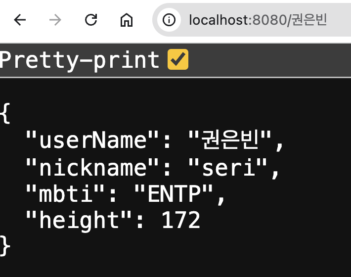

# express의 req.params


익스프레스는 클라이언트 사이드에서 요청이 있을 때, 그 요청에 대한 URL과 path parameter를 파싱해서 `req.params`에 객체 형태로 담아준다.

```javascript
app.get('/:userId', function(req, res) {
	let param = req.params
	console.log(param)
})

// result:
// {
// 	"userId": 34,
// 	"bookId": 8989
// }
```

param 객체에 들어있는 각 원소에 접근하고 싶다면, `.`을 통해 접근하면 된다.

```javascript
app.get('/:userId', function(req, res) {
	let param = req.params
	console.log(param.bookId)
})

// result:
// 8989
```

# 구조 분해 할당(비구조화)

구조 분해 할당 구문은 배열이나 객체의 속성을 해체하여 그 값을 개별 변수에 담을 수 있게 하는 JavaScript 표현식이다. [MDN Docs](https://developer.mozilla.org/ko/docs/Web/JavaScript/Reference/Operators/Destructuring_assignment)

### 배열 구조분해

```javascript
let arr = [1, 2, 3, 4, 5]

var [n1, n2] = arr // n1 = 1, n2 = 2
var [m1, ...m5] = arr // n1 = 1, m5 = [2, 3, 4, 5]
var [ , , n3, n4, n5] = arr // n3 = 3, n4 = 4, n5 = 5

```

### 객체 구조분해

```javascript
let obj1 = { p: 42, q: true }
var { p, q } = obj1 // p = 42, q = true
var { a, b } = obj1 // a = undefined, b = undefined

let obj2 = { poo: 42, qoo: true }
var { p, q } = obj2 // p = undefined, q = undefined
var { poo: p, qoo: q } = obj2 // p = 42, q = true
```

객체 구조분해시에는 객체의 이름과 분해해 정의할 변수의 이름을 맞춰줘야 한다. 다른 이름을 사용하고 싶다면, `var { poo: p, qoo: q } = obj2`와 같이 선언시에 다른 이름을 정의해주거나, 각 변수를 하나씩 만들어 다시 객체로 만들어줘야 한다.

# API 테스트
```javascript
// code/express-api-demo/api.js

let express = require('express')

let user1 = {
	userName: "권은빈",
	nickname: "seri",
	mbti: "ENTP",
	height: 172
}

let user2 = {
	userName: "송은석",
	nickname: "black shadow",
	mbti: "ISTP",
	height: 180
}

let user3 = {
	userName: "백지헌",
	nickname: "honey",
	mbti: "ENFJ",
	height: 165
}

let app = express()
app.listen(8080)

app.get('/', (req, res) => {
	let obj = { poo: 42, qoo: true }
	var { poo: p, qoo: q } = obj
	console.log(p, q)
	var { a, b } = obj
	console.log(a, b)
})

app.get('/:userName', function(req, res) {
	const param = req.params
	
	switch (param.userName) {
		case "권은빈":
			res.json(user1)
			break
		case "송은석":
			res.json(user2)
			break
		case "백지헌":
			res.json(user3)
			break
		default:
			res.json({
				message: "No user found."
			})
	}
})
```



