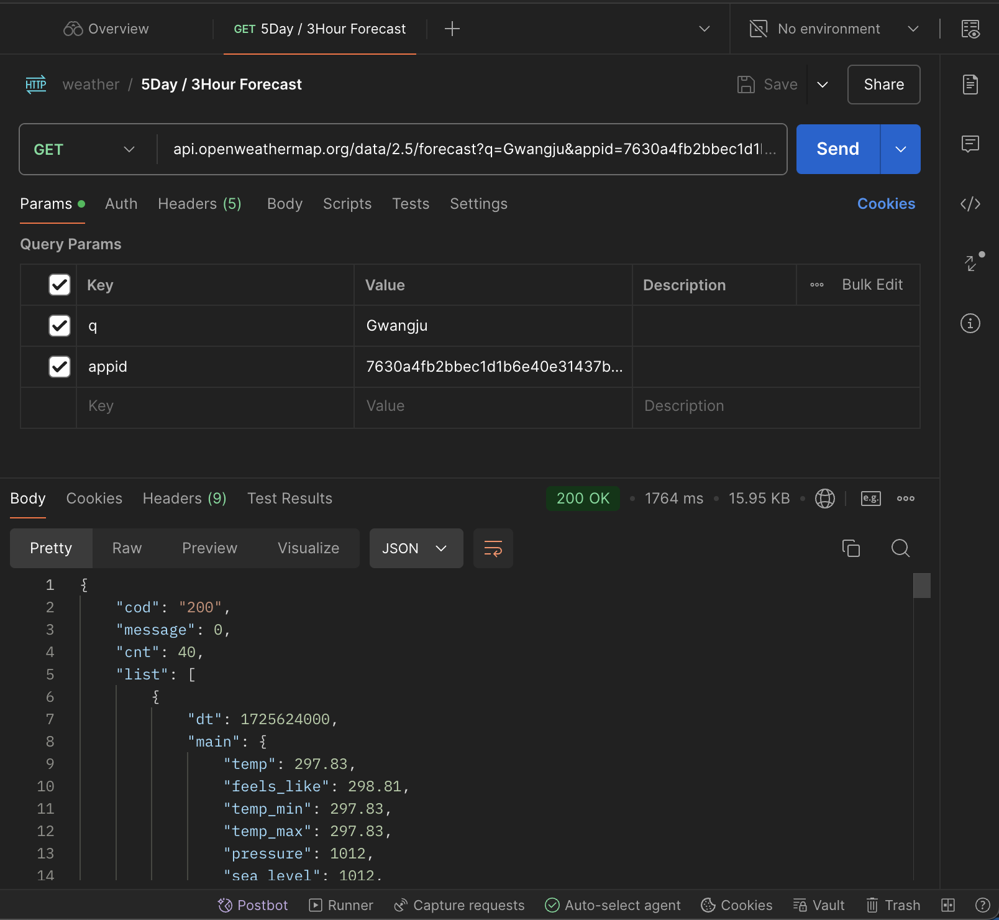
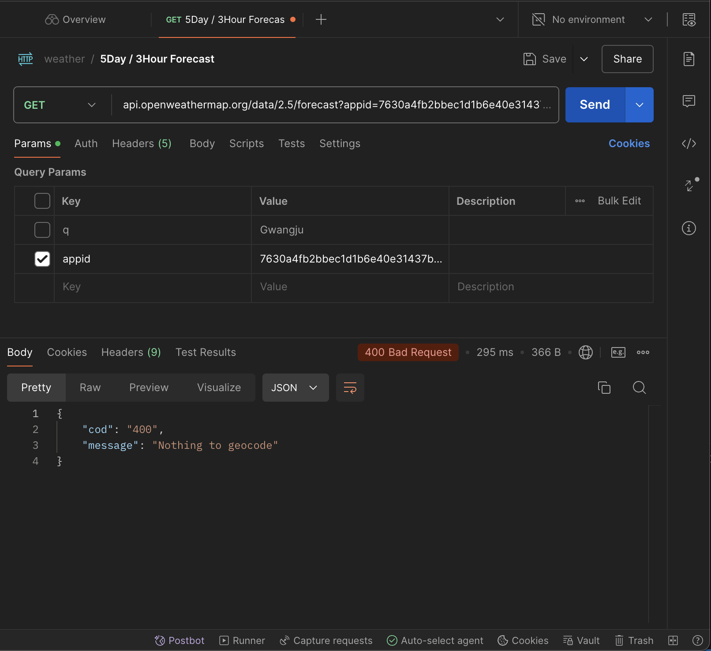
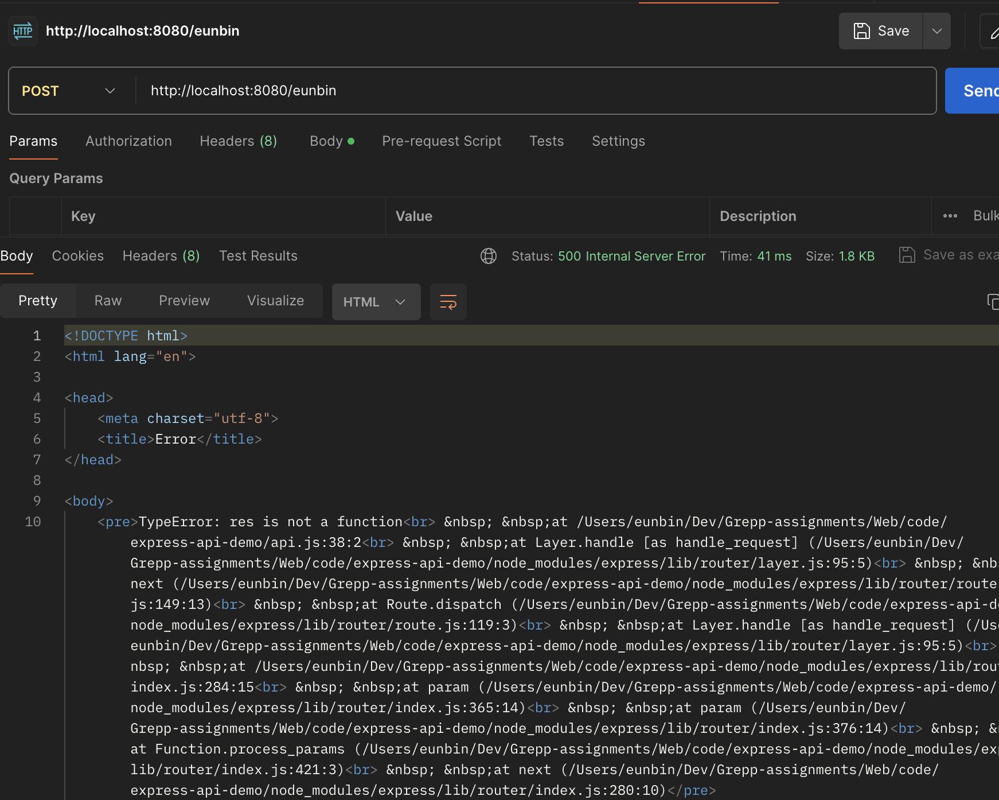

# Postman 실습

## GET





## POST

```js
let express = require('express')
let app = express()
app.listen(8080)

app.get('/', (req, res) => {
	let obj = { poo: 42, qoo: true }
	var { poo: p, qoo: q } = obj
	console.log(p, q)
	var { a, b } = obj
	console.log(a, b)
})

// 일부러 터뜨리기
app.post('/:userName', (req, res) => {
	const b = req.body
	res(500).send(b)
})
```

