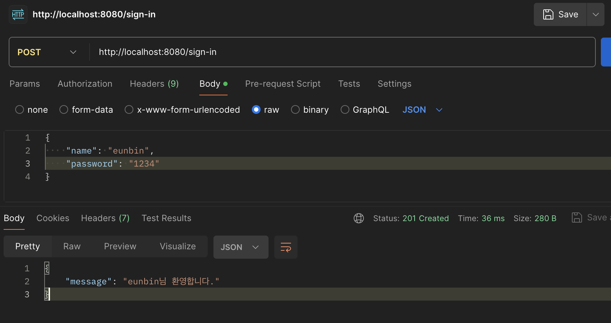
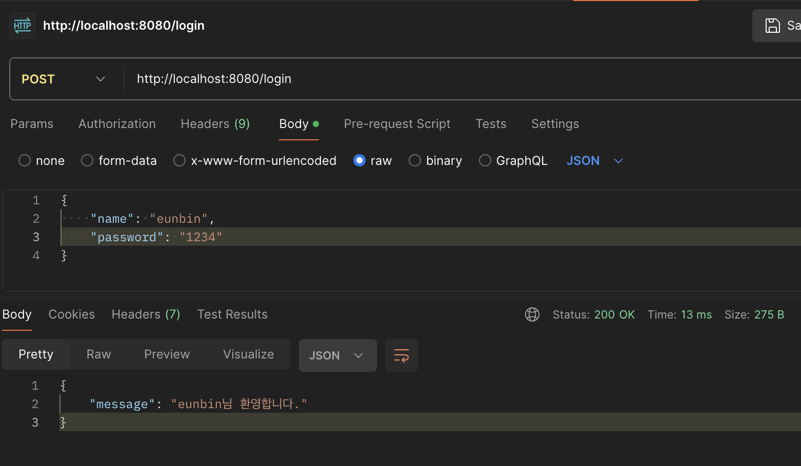
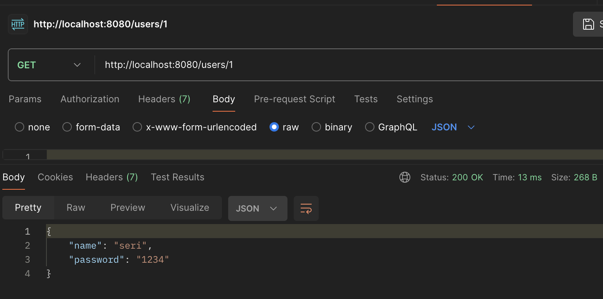
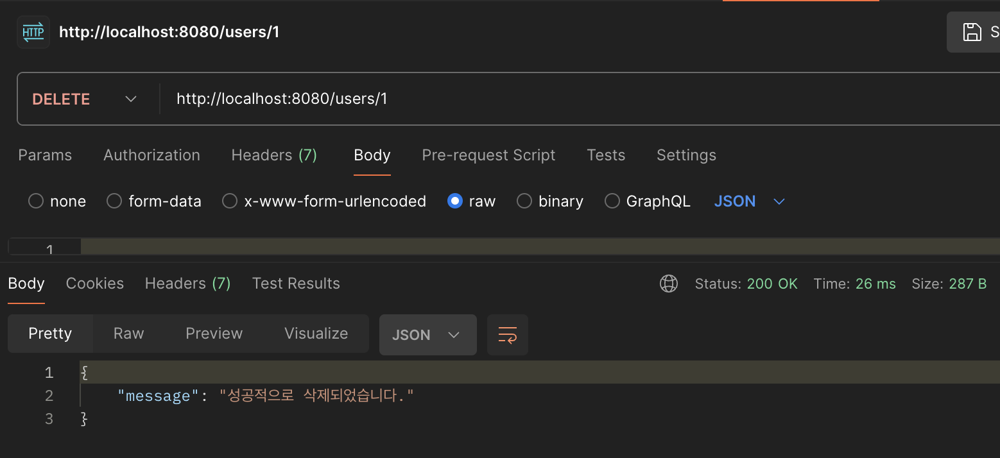

# == vs ===

## equal operator, ==

- 값만 비교하는 것
- 값 자체가 같은지 다른지 비교, 해당 값에 대한 타입은 상관하지 않음.

```js
let a = 1;
let b = '1';

console.log(a == b)
// true
```

## strict equal operator, ===

- 값과 동시에 데이터 타입까지 동일한지 확인한다.

```js
let a = 1;
let b = '1';

console.log(a === b)
// false
```

## 특이 케이스

- 배열의 경우, 변수는 배열의 메모리 주소를 참조하므로 데이터 타입은 같으나 참조하는 메모리 주소가 다르므로 false값이 나올 수 있다.

```js
let a = [1, 2, 3]
let b = [1, 2, 3]
let c = b

/*
a == b // false
a === b // false

b == c // true
b === c // true
*/
```

# 회원가입 API

## code
```js
const express = require('express')
const app = express()

let mockDb = new Map()
let startId = 1

// Default User to test
mockDb.set(startId, {name: "seri", password: "1234"})

app.listen(8080)
app.use(express.json())

// Login
app.post('/login', (req, res) => {
	let user = req.body
	let isUserExist

	for (let v of mockDb.values()) {
		if (v.name === user.name && v.password === user.password) {
			isUserExist = true
		} else {
			isUserExist = false
		}
	}
	
	if (isUserExist == false) {
		res.status(500).json({
			message: `${user.name}에 해당하는 유저가 없습니다.`
		})
	} else {
		res.status(200).json({
			message: `${user.name}님 환영합니다.`
		})
	}
})

// Sign In
app.post('/sign-in', (req, res) => {
	let currentId = ++startId
	
	mockDb.set(currentId, req.body)
	res.status(201).json({
		message: `${mockDb.get(currentId).name}님 환영합니다.`
	})
})

// Get User Info
app.get('/users/:id', (req, res) => {
	let currentUser = mockDb.get(parseInt(req.params.id))

	if (currentUser == undefined) {
		res.status(500).json({
			message: `${req.params.id}에 해당하는 유저가 없습니다.`
		})
	} else {
		res.status(200).json(currentUser)
	}
})

// Delete User
app.delete('/users/:id', (req, res) => {
	let hasUserDeleted = mockDb.delete(parseInt(req.params.id))

	if (hasUserDeleted == false) {
		res.status(500).json({
			message: `${req.params.id}에 해당하는 유저가 없습니다.`
		})
	} else {
		res.status(200).json({
			message: "성공적으로 삭제되었습니다."
		})
	}
})
```

## 결과



